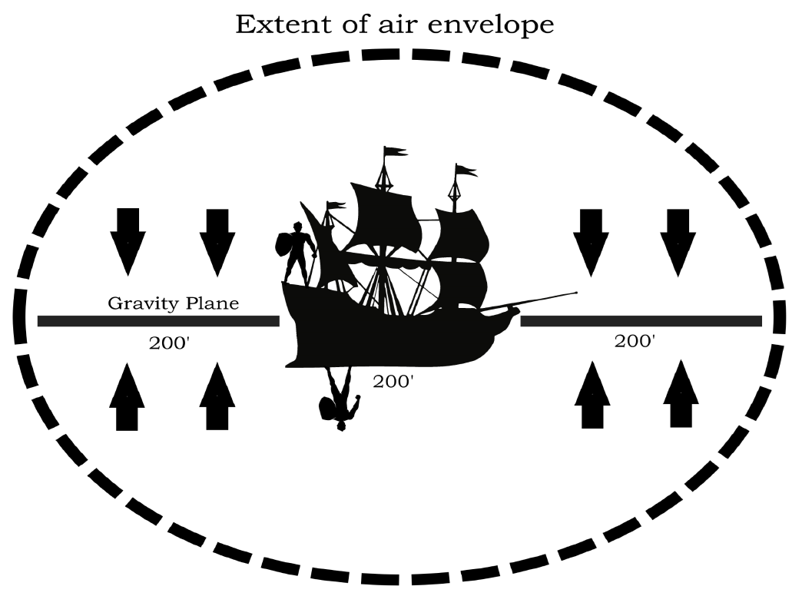

# Cosmology of The Wild Expanse

To the uninitiated groundling, the sky is a ceiling. To a Wildjammer, it is an open sea waiting to be sailed. The universe of **The Wild Expanse** is not a cold, dead vacuum, but a vibrant ocean of energies, islands, and currents.

## The Structure of the Universe

### Wildspace
The void between celestial bodies within a solar system is known as **Wildspace**. It is not empty, but suffused with a magical energy called **Aether**.
*   **Analogy:** If planets are islands, Wildspace is the coastal sea surrounding them.
*   **Environment:** It is airless but has an ambient temperature similar to a cool autumn day, rather than absolute zero.

### Crystal Spheres
Every solar system is encased in a supermassive, indestructible shell known as a **Crystal Sphere**. These spheres separate Wildspace from the Phlogiston.
*   **Analogy:** The hard shell protecting the solar system, separating the coastal waters from the open ocean.
*   **The Boundary:** They are solid, opaque barriers.
*   **Transit:** Travel between the sphere and the outside is only possible through natural or magical portals that open and close along the surface.

### The Phlogiston
Beyond the Crystal Spheres lies the **Phlogiston** (also known as "The Flow" or "The Rainbow Ocean"). It is a chaotic, multi-colored medium that fills the space between Crystal Spheres.
*   **Analogy:** The deep, open ocean that lies between archipelagos (Crystal Spheres).
*   **Properties:** The Flow is a thick, luminescent fog that allows for faster-than-light travel between spheres.
*   **Dangers:**
    *   **Flammability:** The Phlogiston is highly explosive. Open flames and fire magic can cause catastrophic detonations.
    *   **Planar Isolation:** The Flow cuts off access to the Astral Plane and the Gods. Most spellcasters cannot regain spells above 2nd level, and planar travel is impossible.

---

## Physics of the Void

### Gravity Planes
Gravity in the Expanse does not function like planetary physics. It is uniform and extends from any object of sufficient size (25ft or larger).
*   **The Plane:** Gravity pulls towards a flat plane cutting horizontally through the object's center of mass.
*   **On Ships:** Wildjammer ships are designed so the gravity plane aligns with the main deck.
    *   **Above Deck:** Gravity pulls you down to the floor.
    *   **Below Deck:** Gravity pulls you "up" to the ceiling (which is the underside of the main deck).
    *   **Overboard:** If you fall off, you will oscillate back and forth across the gravity plane until you drift to a stop, suspended in the plane.

### Air Envelopes

Objects and creatures drag a bubble of air with them when leaving an atmosphere.
*   **Capacity:** The size of the envelope depends on the size of the object. A ship carries enough air for its crew for months; a single person only for minutes.
*   **Air Quality:**
    1.  **Fresh:** Breathable and normal.
    2.  **Foul:** Stale and humid. All checks are made with Disadvantage.
    3.  **Lethal:** Toxic. Causes Exhaustion and eventual death.
*   **Replenishment:** Entering a larger air envelope (like a planet's atmosphere) instantly refreshes a ship's air.

## The Astral Sea
While the Phlogiston connects the worlds of the Material Plane, the **Astral Sea** connects the planes of existence. It is a silvery, timeless void of thought and memory.
*   **Access:** Ships cannot sail directly from Wildspace or the Phlogiston into the Astral Sea. It requires expensive arcane hull etchings and the *Plane Shift* spell to transition the vessel.
*   **The Planes:** Massive "continents" of reality floating in the silver void. Access to specific planes depends on the beliefs and connections of the Crystal Sphere you depart from.
*   **Dangers:** The Astral Sea is the battlefield of the Gods and the Blood War. Astral Dreadnoughts and Githyanki raiders are common threats.

## Magical Navigation
For high-level spellcasters, magic can bypass physical sailing, though it follows strict navigational limits.
*   **Teleport:** Instantly moves creatures within the *same* Crystal Sphere or Plane. It cannot cross the boundary of a Sphere.
*   **Dream of the Blue Veil:** Teleports creatures from one Crystal Sphere to another, bypassing the Phlogiston entirely.
*   **Plane Shift:** Transports creatures (or ships with the proper upgrades) from a Crystal Sphere to a linked Plane in the Astral Sea.